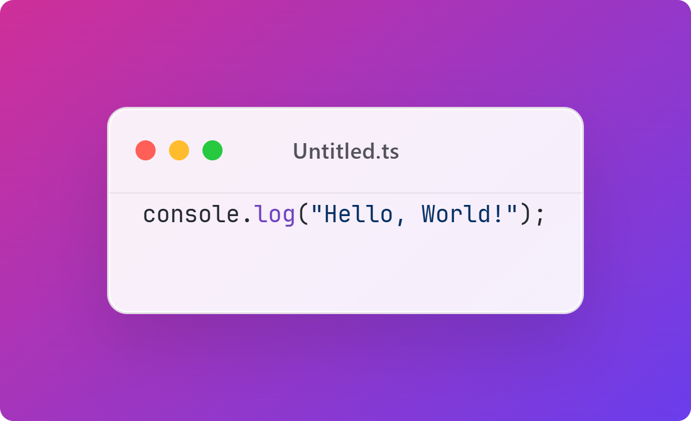
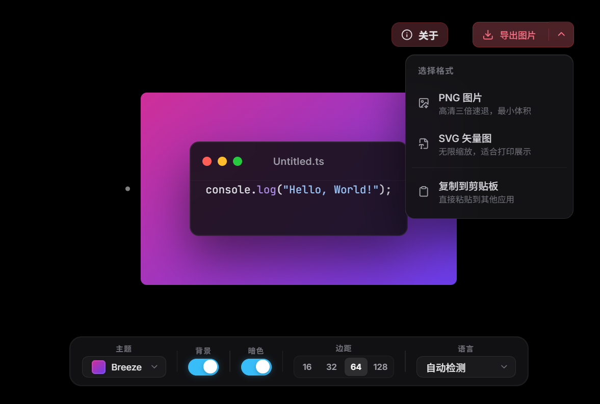
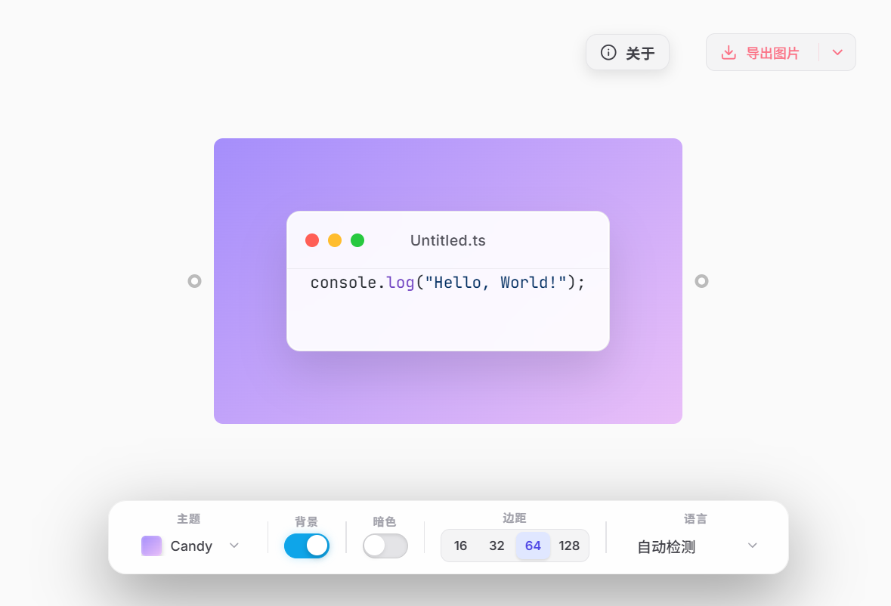

# Code Screenshot

一款ztools代码截图工具插件，基于 Vue 3 + Shiki 构建。能够将您的代码片段转化为精美的设计图片，支持语法高亮与多种主题。



## 功能特性

### 精美主题
- 10+ 精心设计的渐变背景主题
- 支持深色/浅色模式切换
- 专业的 macOS 风格代码窗口

### 多语言支持
支持超过 50+ 种编程语言：

JavaScript, TypeScript, Python, Java, Go, Rust, C/C++, C#, PHP, Ruby, Swift, Kotlin, Scala, Vue, React, HTML, CSS, SCSS, JSON, YAML, XML, SQL, Markdown 等等...

### 灵活输入
- 直接输入代码
- 拖拽代码文件自动识别语言
- 读取系统剪贴板代码

### 多种导出方式
- 导出为 PNG 图片
- 导出为 SVG 向量图
- 一键复制到剪贴板

### 主题体验
- 可调节代码窗口宽度
- 可调节内边距大小
- 玻璃拟态 UI 设计

## 主题预览

| 深色模式 | 浅色模式 |
|---------|---------|
|  |  |

## 快速开始

```bash
# 安装依赖
pnpm install

# 开发模式
pnpm dev

# 构建生产版本
pnpm build
```

## 项目结构

```
code-screenshot/
├── public/                 # 静态资源
│   ├── logo.svg           # 插件图标
│   └── plugin.json        # 插件配置
├── src/
│   ├── components/        # Vue 组件
│   │   ├── CodeWindow.vue    # 代码窗口
│   │   ├── Toolbar.vue       # 工具栏
│   │   └── AboutModal.vue    # 关于弹窗
│   ├── composables/       # 组合式函数
│   │   └── useShiki.ts   # Shiki 高亮
│   ├── libs/              # 组件库
│   │   ├── components/   # UI 组件
│   │   └── toast.ts      # 提示组件
│   ├── styles/           # 样式文件
│   ├── store.ts          # 状态管理
│   └── App.vue           # 根组件
├── images/                # 示例图片
├── scripts/              # 构建脚本
└── package.json
```

## 使用说明

1. 输入代码：在代码窗口中直接输入或粘贴代码
2. 拖拽文件：将代码文件拖入窗口，自动识别语言
3. 选择主题：点击工具栏选择喜欢的背景主题
4. 切换模式：根据需要切换深色/浅色模式
5. 导出图片：点击导出按钮保存为 PNG 或 SVG

## 许可证

MIT License - 欢迎开源贡献

---

<div align="center">

Made with love by [nichijoux](https://github.com/nichijoux)

</div>
