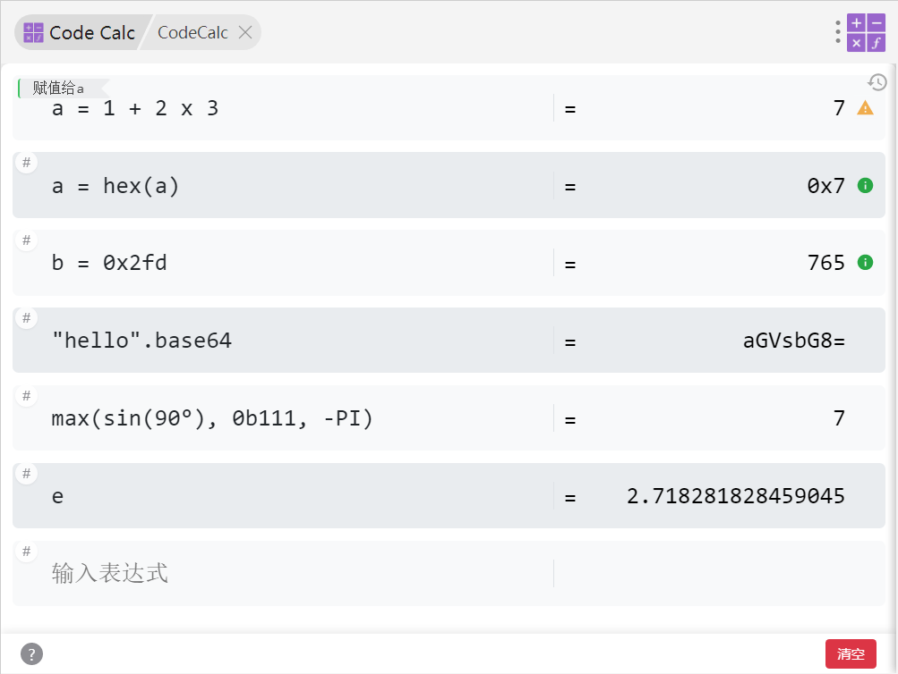

# CodeCalc
[](https://opensource.org/licenses/MIT)

一个支持代码风格计算的 ZTools / 浏览器双端插件。



## Web端编译使用方法

```bash
cd core
# npm/pnpm安装依赖
pnpm install
# npm/pnpm构建项目, 在../app/src下生成app.bundle.js和calculator.min.js
pnpm build
# 在app下直接访问index.html即可使用
cd ../app
```

## 主要功能

### 变量和赋值：
- 基本赋值：`a = 5`
- 复合赋值：`+=`, `-=`, `*=`, `/=`, `%=`, `&=`, `|=`, `^=`, `<<=`, `>>=`, `>>>=`

### 基本运算：
- 算术运算：`+`, `-`, `*`, `/`, `//`, `%`, `**`
- 位运算：`&`, `|`, `^`, `~`, `<<`, `>>`, `>>>`
- 别名支持：`and`, `or`, `not`, `x`(未定义变量`x`时可以用作乘号)

### 数学函数：
- 三角函数：`sin`, `cos`, `tan`, `asin`, `acos`, `atan`
- 对数指数：`log`, `ln`, `exp`, `pow`, `sqrt`
- 其他：`abs`, `max`, `min`

### 角度转换：
- 角度转弧度：`rad(45)` 或 `45°` 或 `.rad`
- 弧度转角度：`deg(PI)` 或 `.deg`


### 字符串操作：
- 字符串：`s = "Hello"`, 支持 `+` 连接，如 `"Hello" + "World"`
- 字符串属性：`.length`, `.upper`, `.lower`
- base64 编解码：`base64(s)` 或 `.base64`, `unbase64(s)` 或  `.unbase64`

### 进制转换：
- 输入：`0b`(二进制), `0o`(八进制), `0x`(十六进制)
- 输出：`.bin`, `.oct`, `.hex`

### 常量：
- `π`, `PI`, `pi`: 3.14159...
- `E`,`e`: 2.71828...

### 自定义函数与常量：
- 新增自定义函数：`f(x) = x + 1`
- 多参数函数：`sum2(a, b) = a + b`
- 新增自定义常量：`mypi := 3.14159`
- 支持函数注释：`inc(x) = x + 1 ; // increment by one`
- 定义后可直接调用：`f(10)`, `sum2(3, 4)`, `mypi * 2`
- 支持数值/字符串/日期时长/向量/矩阵等类型作为参数（如 `f("123")`, `f(#1d)`, `f([1 2 3])`, `f({1 2;3 4})`）
- 在插件 UI 的 **Functions & Constants** 页面可新增、编辑、删除并持久化保存自定义定义

### 时间戳：
- `@now`: 当前时间戳
- `@today`: 今天日期
- `@2000-06-01 11:30:01`: 指定日期时间
- `@now + #1w2d3h`: 当前时间加1周2天3小时
- `@now - #1y2m3d5h7s`: 当前时间减1年2月3天5小时7秒

### 矩阵和向量：
- 向量：`[1, 2, 3]`
- 矩阵：`{1, 2; 3 4}`
- `eye(3)`: 生成3x3单位矩阵
- `diag([1, 2, 3])`: 生成对角矩阵
- `ones(2, 3)`: 生成2x3全1矩阵
- `zeros(2, 3)`: 生成2x3全0矩阵
- `random(2, 3)`: 生成2x3随机矩阵
- 矩阵和向量支持 加 减 乘 除, 幂运算(element-wise)
- 矩阵乘法
- 矩阵转置
- 矩阵求逆
- 矩阵特征值

### 快捷键
- `Ctrl + /` or `⌘ + /` 显示快捷键面板


> [!TIP]
> 详细文档请参考 [CodeCalc 文档](https://epleone.github.io/codecalc-doc/)


## Credits
灵感来源：[itribs/rcalculator](https://github.com/itribs/rcalculator)
