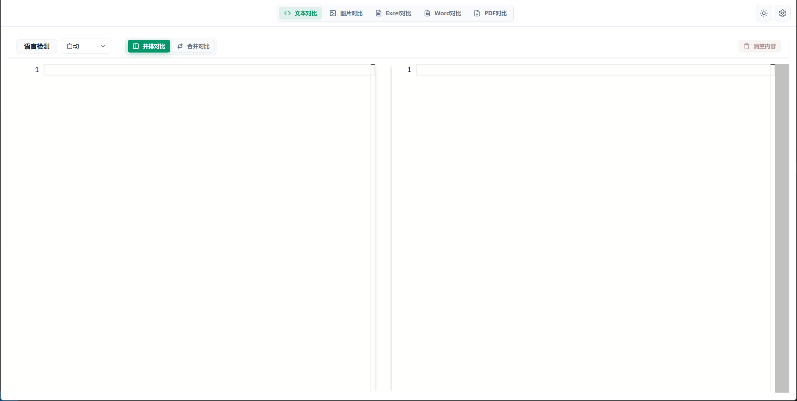
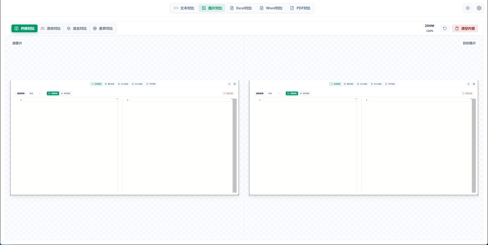
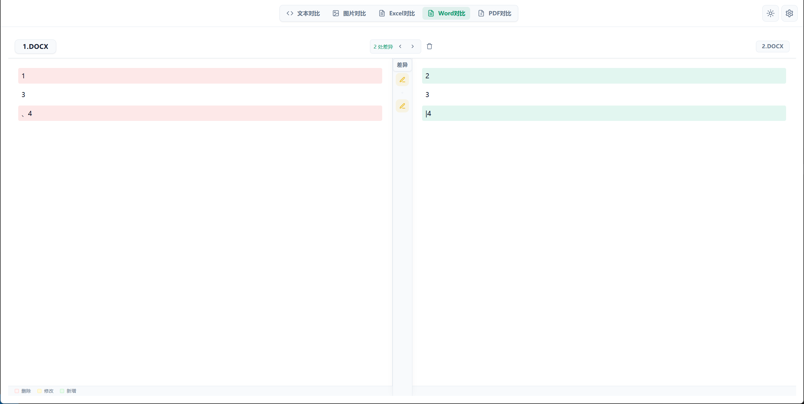
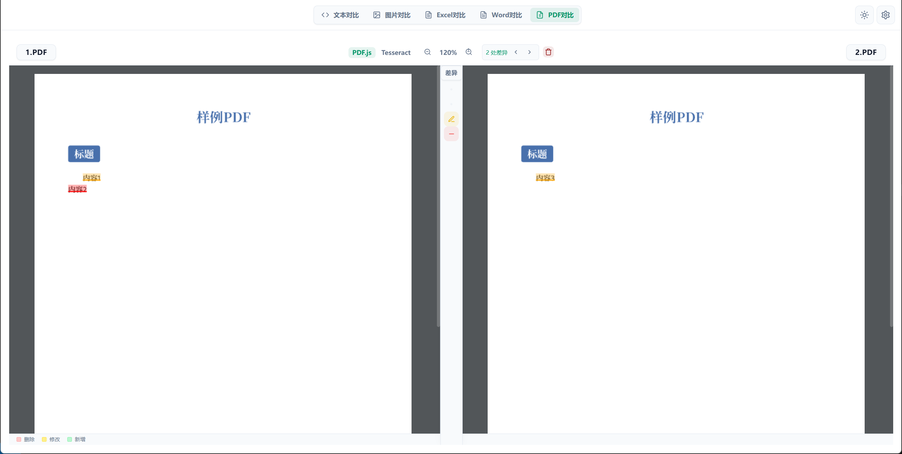

# Diff Compare

> 多模态差异对比工具 | Multi-modal Diff Comparison Tool

一个基于 **Vue 3 + Vite + TypeScript** 构建的 ZTools 插件，支持文本、代码、图片、Excel、Word、PDF 等多种格式的实时差异对比。

## 功能特性

### 文本对比



- 支持代码与纯文本对比
- 语法高亮（基于 Monaco Editor）
- 自动格式化（支持 JSON、JavaScript、TypeScript、HTML、CSS 等）
- 同步滚动
- 差异导航（上一处/下一处差异）

### 图片对比



- 支持 PNG、JPG、JPEG、BMP、GIF、WebP 格式
- 像素级差异检测（基于 Pixelmatch）
- 可调节差异阈值
- 差异可视化高亮

### Excel 对比


- 支持 .xlsx、.xls、.csv 格式
- 表格级差异对比
- 单元格级别变更检测
- 差异统计与导航

### Word 对比



- 支持 .docx 格式
- 段落级差异对比
- 格式变更检测
- 清晰的差异标记

### PDF 对比



- 支持 .pdf 格式
- 文本内容提取与对比
- 双引擎支持：
  - PDF.js（快速，适用于可选中文本）
  - Tesseract OCR（适用于扫描版 PDF）
- 缩放控制（放大、缩小、重置）
- 差异高亮与导航

## 技术栈

- 前端框架：Vue 3 + TypeScript
- 构建工具：Vite
- 状态管理：Pinia
- 国际化：vue-i18n（支持中文、英文、日文）
- Diff 核心库：
  - `diff` - 文本差异计算
  - `monaco-editor` - 代码编辑器与语法高亮
  - `pixelmatch` - 图片像素对比
  - `xlsx` - Excel 文件解析
  - `mammoth` - Word 文档解析
  - `pdfjs-dist` - PDF 渲染与文本提取
  - `tesseract.js` - OCR 文字识别

## 快速开始

### 安装依赖

```bash
pnpm install
```

### 开发模式

```bash
pnpm run dev
```

开发服务器将在 `http://localhost:8080` 启动。

### 构建生产版本

```bash
pnpm run build
```

## 项目结构

```
diff-compare/
├── public/
│   ├── logo.png              # 插件图标
│   ├── plugin.json           # 插件配置
│   └── preload/              # Preload 脚本
├── src/
│   ├── main.ts               # 入口文件
│   ├── App.vue               # 根组件
│   ├── components/
│   │   ├── diff-views/       # 各类文件对比视图
│   │   │   ├── text/         # 文本对比
│   │   │   ├── image/        # 图片对比
│   │   │   ├── excel/        # Excel 对比
│   │   │   ├── word/         # Word 对比
│   │   │   └── pdf/          # PDF 对比
│   │   ├── layout/           # 布局组件
│   │   ├── shared/           # 共享组件
│   │   └── ui/               # UI 组件库
│   ├── composables/          # 组合式函数
│   │   ├── useText/          # 文本对比逻辑
│   │   ├── useImage/         # 图片对比逻辑
│   │   ├── useExcel/         # Excel 对比逻辑
│   │   ├── useWord/          # Word 对比逻辑
│   │   ├── usePdf/           # PDF 对比逻辑
│   │   └── useTheme.ts       # 主题管理
│   ├── core/
│   │   ├── diff/             # 差异算法核心
│   │   └── ocr/              # OCR 引擎
│   ├── i18n/
│   │   └── locales/          # 国际化文件
│   └── utils/                # 工具函数
├── images/                   # 项目截图
├── index.html
├── vite.config.ts
├── tsconfig.json
├── package.json
└── README.md
```

## 国际化

支持以下语言：
- 中文 (zh)
- English (en)
- 日本語 (ja)

## 使用指南

### 基本操作

1. 加载文件：拖拽文件到对应区域或点击选择文件
2. 清除内容：点击工具栏清除按钮
3. 导航差异：使用"上一处""下一处"按钮或点击差异标记
4. 切换语言：通过设置面板更改界面语言

### PDF 特殊功能

- OCR 引擎切换：可选择 PDF.js（快速）或 Tesseract（OCR）
- 缩放控制：支持 30%-500% 缩放范围
- 扫描版 PDF：使用 Tesseract OCR 引擎进行文本识别

## 依赖版本

- Vue: ^3.5.13
- Vite: ^6.0.11
- TypeScript: ^5.3.0
- Monaco Editor: ^0.55.1
- PDF.js: ^5.5.207
- Tesseract.js: ^7.0.0

## 开源协议

MIT License

---

祝你使用愉快！